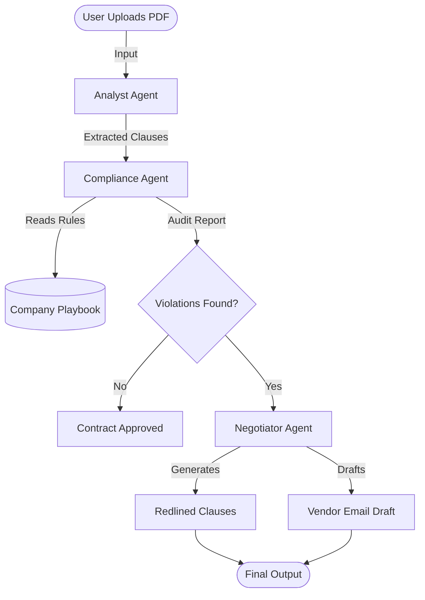

# ContractGuard: The Autonomous Legal Associate

**ContractGuard** is an agentic AI system designed to automate the review, compliance checking, and negotiation of legal contracts. Built for the **Kaggle Agents Intensive Capstone**, it acts as a first-line "Robot Lawyer" to unblock legal bottlenecks.

---

## The Problem
Legal departments are drowning in high-volume, low-complexity contracts (NDAs, MSAs, Vendor Agreements).
* **Speed:** Business deals stall for weeks waiting for simple reviews.
* **Cost:** Highly paid lawyers spend 30% of their time on routine policy checks.
* **Risk:** Fatigue leads to human error, allowing risky terms (like "Net-90" payment terms) to slip through.

## The Solution
ContractGuard is a **Multi-Agent System** that reads PDF contracts, enforces a strict "Company Playbook," and autonomously drafts the solution. It doesn't just flag problems—it **fixes** them by generating legal redlines and negotiation emails ready for sending.

---

## Architecture

The system utilizes a sequential **Multi-Agent Workflow** powered by **Google Gemini 2.5 Flash**.

## The "Legal Team" (Agents)
1.  **The Analyst (Ingestion):**
    * **Role:** Optical Character Recognition (OCR) and Semantic Extraction.
    * **Task:** Reads the raw PDF, removes formatting noise, and extracts verbatim clauses for Payment, Liability, and Jurisdiction.
2.  **The Compliance Officer (Reasoning):**
    * **Role:** Policy Enforcement Logic.
    * **Task:** Compares extracted clauses against the "Company Playbook" (e.g., *“Payment must be Net-45 or less”*). Assigns a **PASS/FAIL** status to each clause.
3.  **The Negotiator (Action):**
    * **Role:** Generative Drafting.
    * **Task:** If violations are found, it rewrites the clause (Redlining) to be compliant and drafts a polite, persuasive email to the vendor.

## System Diagram



## Key Features
* PDF Ingestion: Uses pypdf to parse real-world legal documents.
* Context-Aware Memory: Utilizes Gemini's long context window to hold the entire contract and legal playbook in memory simultaneously.
* Automated Redlining: Goes beyond simple "summarization" to actually rewrite specific legal text.
* Risk Scoring: Instantly categorizes clauses as [PASS] or [VIOLATION].

## Setup & Installation
Prerequisites
* Python 3.10+
* A Google Cloud Project with the Gemini API enabled.
* An API Key from Google AI Studio.

Installation
1. **Clone the repository:**
```
git clone [https://github.com/yourusername/contractguard.git](https://github.com/yourusername/contractguard.git)
cd contractguard
```

2. **Install dependencies:**
```
pip install google-generativeai pypdf IPython
```

3. **Set up your API Key:**
```
export GOOGLE_API_KEY="your_api_key_here"
```

## How to Run

1. **Place a Contract:** Put your PDF file in the project folder (or use the included create_test_pdf function to generate a dummy contract).

2. **Run the Script:**
``` python contract_guard.py ```

3. **View Output:**
* The terminal will display the Analyst's Extraction.
* Followed by the Compliance Audit.
* If violations are found, the Negotiation Draft will be generated and saved to Negotiation_Draft.txt.

## **Project Structure**
```
contractguard/
├── contract_guard.py       # Main application logic
├── requirements.txt        # Python dependencies
├── README.md               # Documentation
├── vendor_contract.pdf     # Sample input file (generated)
└── Negotiation_Draft.txt   # Sample output file
```

## Tech Stack
* Model: Google Gemini 2.5 Flash
* Language: Python
* Libraries: google-generativeai, pypdf, IPython

## License
This project is open-source and available under the MIT License.
